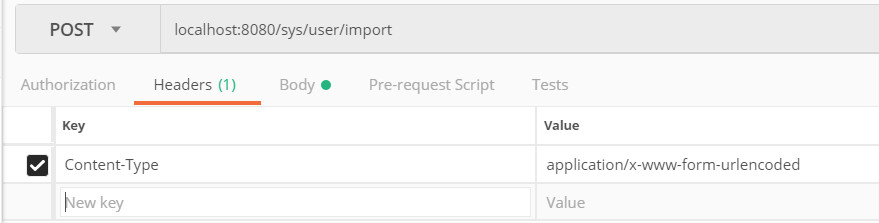
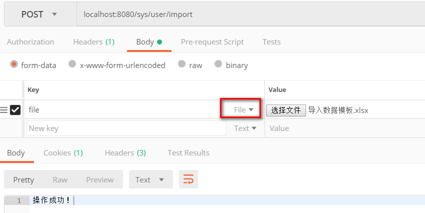
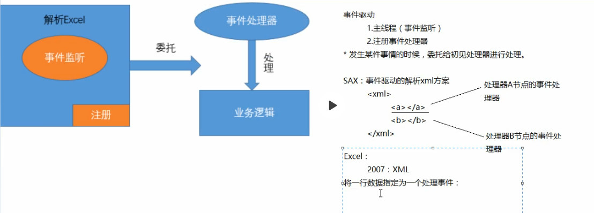

# POI入门与百万数据量导入导出

## 1 入门

### 1.1 搭建环境 

```xml
<dependencies>
        <dependency>
            <groupId>org.apache.poi</groupId>
            <artifactId>poi</artifactId>
            <version>4.0.1</version>
        </dependency>
        <dependency>
            <groupId>org.apache.poi</groupId>
            <artifactId>poi-ooxml</artifactId>
            <version>4.0.1</version>
        </dependency>
        <dependency>
            <groupId>org.apache.poi</groupId>
            <artifactId>poi-ooxml-schemas</artifactId>
            <version>4.0.1</version>
        </dependency>
</dependencies>
```

### 1.2 API介绍

| 类        | 说明                                                         |
| --------- | ------------------------------------------------------------ |
| workbook  | Excel的文档对象,类型分为：HSSFWorkbook（2003）和 XSSFWorkbool（2007） |
| Sheet     | Excel的表单                                                  |
| Row       | Excel的行                                                    |
| Cell      | Excel的格子单元                                              |
| Font      | Excel字体                                                    |
| CellStyle | 格子单元样式                                                 |

### 1.3 基本操作

#### 1.3.1 创建Excel 

```java
//1.创建工作簿  HSSFWorkbook -- 2003
Workbook wb = new XSSFWorkbook(); //2007版本
//2.创建表单sheet
Sheet sheet = wb.createSheet("test01");
//3.文件流
FileOutputStream fos = new FileOutputStream("E:\\testFile.xlsx");
//4.写入文件
wb.write(fos);
//5.关闭流
fos.close();
```

#### 1.3.2 创建单元格写入内容

```java
// 创建工作簿  HSSFWorkbook -- 2003
Workbook wb = new XSSFWorkbook(); //2007版本
// 创建表单sheet
Sheet sheet = wb.createSheet("test");
// 创建行对象  参数：索引（从0开始）
Row row = sheet.createRow(2);
// 创建单元格对象  参数：索引（从0开始）
Cell cell = row.createCell(2);
// 向单元格中写入内容
cell.setCellValue("写入测试");
// 文件流
FileOutputStream fos = new FileOutputStream("E:\\testFile02.xlsx");
// 写入文件
wb.write(fos);
// 关闭流
fos.close();
```

#### 1.3.3 设置格式 ，合并单元格

```java
//创建单元格样式对象
CellStyle cellStyle = wb.createCellStyle();
//设置边框
cellStyle.setBorderBottom(BorderStyle.DASH_DOT);//下边框
cellStyle.setBorderTop(BorderStyle.HAIR);//上边框
//设置字体
Font font = wb.createFont();//创建字体对象
font.setFontName("华文行楷");//设置字体
font.setFontHeightInPoints((short) 28);//设置字号
cellStyle.setFont(font);
//设置宽高
sheet.setColumnWidth(0, 31 * 256);//设置第一列的宽度是31个字符宽度
row.setHeightInPoints(50);//设置行的高度是50个点
//设置居中显示
cellStyle.setAlignment(HorizontalAlignment.CENTER);//水平居中
cellStyle.setVerticalAlignment(VerticalAlignment.CENTER);//垂直居中
//设置单元格样式
cell.setCellStyle(cellStyle);
//合并单元格
CellRangeAddress region = new CellRangeAddress(0, 3, 0, 2);
sheet.addMergedRegion(region);
```

#### 1.3.4 插入图片

```java
//1.创建工作簿  HSSFWorkbook -- 2003
Workbook wb = new XSSFWorkbook(); //2007版本
//2.创建表单sheet
Sheet sheet = wb.createSheet("test01");
//3.读取图片流
FileInputStream stream = new FileInputStream("E:\\logo.jpg");
//4.转化二进制数组
byte[] bytes = IOUtils.toByteArray(stream);
//5.向POI内存中添加一张图片，返回图片在图片集合中的索引
//参数一：图片的二进制数据，参数二：图片类型
int index = wb.addPicture(bytes, Workbook.PICTURE_TYPE_JPEG);
//6.绘制图片工具类
CreationHelper helper = wb.getCreationHelper();
//7.创建一个绘图对象
Drawing<?> patriarch = sheet.createDrawingPatriarch();
//8.创建锚点，设置图片坐标
ClientAnchor anchor = helper.createClientAnchor();
anchor.setRow1(0);
anchor.setCol1(0);
//9.绘制图片
Picture picture = patriarch.createPicture(anchor, index);//图片位置，图片的索引
picture.resize();//自适应渲染图片
//10.文件流
FileOutputStream fos = new FileOutputStream("E:\\testFile03.xlsx");
//11.写入文件
wb.write(fos);
//12.关闭流
fos.close();
```

#### 1.3.5 读取excel并解析

```java
public static void main(String[] args) throws Exception {

        //1.创建workbook工作簿
        Workbook wb = new XSSFWorkbook("E:\\demo.xlsx");
        //2.获取sheet 从0开始
        Sheet sheet = wb.getSheetAt(0);
        int totalRowNum = sheet.getLastRowNum();

        Row row = null;
        Cell cell = null;

        //循环所有行
        for (int rowNum = 0; rowNum < sheet.getLastRowNum(); rowNum++) {
            row = sheet.getRow(rowNum);
            StringBuilder sb = new StringBuilder();
            //循环每行中的所有单元格
            for (int cellNum = 2; cellNum < row.getLastCellNum(); cellNum++) {
                cell = row.getCell(cellNum);
                sb.append(getValue(cell)).append("--");
            }
            System.out.println(sb.toString());
        }

    }

    //获取数据
    private static Object getValue(Cell cell) {
        Object value = null;
        switch (cell.getCellType()) {
            case STRING: //字符串类型
                value = cell.getStringCellValue();
                break;
            case BOOLEAN: //boolean类型
                value = cell.getBooleanCellValue();
                break;
            case NUMERIC: //数字类型（包含日期和普通数字）
                if (DateUtil.isCellDateFormatted(cell)) {
                    value = cell.getDateCellValue(); // 日期
                } else {
                    value = cell.getNumericCellValue(); // 数值
                }
                break;
            case FORMULA: // 公式类型
                value = cell.getCellFormula();
                break;
            default:
                break;
        }
        return value;
    }
```

##  2 常用导入与导出

### 2.1 excel导入

#### 2.1.1 实体类 

(新增一个根据数组构造对象的构造函数)

```java
public class User {

    /**
     * ID
     */
    private String id;
    /**
     * 手机号码
     */
    private String mobile;
    /**
     * 用户名称
     */
    private String username;
    /**
     * 密码
     */
    private String password;
    /**
     * 工号
     */
    private String workNumber;
    /**
     * 聘用形式
     */
    private Integer formOfEmployment;
    /**
     * 入职时间
     */
    private Date timeOfEntry;
    /**
     * 部门ID
     */
    private String departmentId;
    /**
     * 部门名称
     */
    private String departmentName;
    /**
     * 创建时间
     */
    private Date createTime;

    public User(Object[] values) {
        // 用户名 手机号 工号 聘用形式 入职时间	部门ID
        this.username = values[1].toString();
        this.mobile = values[2].toString();
        //默认excel读取为字符串会存在科学记数法问题，转化处理    #：没有则为空
        this.workNumber = new DecimalFormat("#").format(values[3]).toString();
        this.formOfEmployment = ((Double) values[4]).intValue();
        this.timeOfEntry = (Date) values[5];
        this.departmentId = values[6].toString();
    }
}
```

#### 2.1.2  controller

(使用@RequestParam(name = "file") MultipartFile attachment 接受文件)

```java
@RequestMapping(value = "/user/import", method = RequestMethod.POST)
public String importExcel(@RequestParam(name = "file") MultipartFile attachment) throws Exception {
        //根据上传流信息创建工作簿
        Workbook workbook = WorkbookFactory.create(attachment.getInputStream());
        //获取第一个sheet
        Sheet sheet = workbook.getSheetAt(0);
        List<User> users = new ArrayList<>();
        //从第二行开始获取数据
        for (int rowNum = 1; rowNum <= sheet.getLastRowNum(); rowNum++) {
            Row row = sheet.getRow(rowNum);
            Object objs[] = new Object[row.getLastCellNum()];
            //从第二列获取数据
            for (int cellNum = 1; cellNum < row.getLastCellNum(); cellNum++) {
                Cell cell = row.getCell(cellNum);
                objs[cellNum] = getCellValue(cell);
            }
            //根据每一列构造用户对象
            User user = new User(objs);
            users.add(user);
        }
        System.out.println(users.size());
        return "操作成功！";
    }

// 获取value值 
public static Object getCellValue(Cell cell) {
        //1.获取到单元格的属性类型
        CellType cellType = cell.getCellType();
        //2.根据单元格数据类型获取数据
        Object value = null;
        switch (cellType) {
            case STRING:
                value = cell.getStringCellValue();
                break;
            case BOOLEAN:
                value = cell.getBooleanCellValue();
                break;
            case NUMERIC:
                if (DateUtil.isCellDateFormatted(cell)) {
                    //日期格式
                    value = cell.getDateCellValue();
                } else {
                    //数字
                    value = cell.getNumericCellValue();
                }
                break;
            case FORMULA: //公式
                value = cell.getCellFormula();
                break;
            default:
                break;
        }
        return value;
    }
```

#### 2.1.3 使用postman测试

<div align= center>
    
</div>

<div align= center>
    
</div>

### 2.2 excel导出

#### 2.2.1 实体类

```java
public class Employee {

    /**
     * 编号
     */
    private String userId;
    /**
     * 姓名
     */
    private String username;
    /**
     * 手机
     */
    private String mobile;
    /**
     * 最高学历
     */
    private String theHighestDegreeOfEducation;
    /**
     * 入职时间
     */
    private String timeOfEntry;
    /**
     * 生日
     */
    private String birthday;
    /**
     * 年龄
     */
    private String age;
    /**
     * 离职时间
     */
    private String resignationTime;
    /**
     * 离职类型
     */
    private String typeOfTurnover;
    /**
     * 申请离职原因
     */
    private String reasonsForLeaving;
}
```

#### 2.2.2 controller

```java
@RequestMapping(value = "/export/{month}", method = RequestMethod.GET)
    public void export(@PathVariable(name = "month") String month) throws Exception {

        ServletRequestAttributes sra = (ServletRequestAttributes) RequestContextHolder.getRequestAttributes();
        HttpServletResponse response = sra.getResponse();

        //1.获取数据。 加百分号是方便后期使用LIKE查询
        List<Employee> list = userService.findByMonth(month + "%");
        //2.创建工作簿
        XSSFWorkbook workbook = new XSSFWorkbook();
        //3.构造sheet
        Sheet sheet = workbook.createSheet();
        //4.标题
        String[] titles = {"编号", "姓名", "手机", "最高学历", "生日", "入职时间", "离职类型", "离职原因", "离职时间"};
        Row row = sheet.createRow(0);

//        int titleIndex=0;
//        for (String title : titles) {
//            Cell cell = row.createCell(titleIndex++);
//            cell.setCellValue(title);
//        }
        AtomicInteger headersAi = new AtomicInteger(); // 从索引0开始
        for (String title : titles) {
            Cell cell = row.createCell(headersAi.getAndIncrement());
            cell.setCellValue(title);
        }
        AtomicInteger datasAi = new AtomicInteger(1);
        Cell cell = null;
        for (Employee employee : list) {
            Row dataRow = sheet.createRow(datasAi.getAndIncrement());
            //编号
            cell = dataRow.createCell(0);
            cell.setCellValue(employee.getUserId());
            //姓名
            cell = dataRow.createCell(1);
            cell.setCellValue(employee.getUsername());
            //手机
            cell = dataRow.createCell(2);
            cell.setCellValue(employee.getMobile());
            //最高学历
            cell = dataRow.createCell(3);
            cell.setCellValue(employee.getTheHighestDegreeOfEducation());
            //生日
            cell = dataRow.createCell(4);
            cell.setCellValue(employee.getBirthday());
            //入职时间
            cell = dataRow.createCell(5);
            cell.setCellValue(employee.getTimeOfEntry());
            //离职类型
            cell = dataRow.createCell(6);
            cell.setCellValue(employee.getTypeOfTurnover());
            //离职原因
            cell = dataRow.createCell(7);
            cell.setCellValue(employee.getReasonsForLeaving());
            //离职时间
            cell = dataRow.createCell(8);
            cell.setCellValue(employee.getResignationTime());
        }

        ByteArrayOutputStream os = new ByteArrayOutputStream();
        workbook.write(os);
        new DownloadUtils().download(os, response, month + "月份报表.xlsx");
    }
```

#### 2.2.3 service层

（造些数据）

```java
public List<Employee> findByMonth(String month) {

        List list = new ArrayList<Employee>();

        for (int i = 0; i < 10; i++) {
            Employee employee = new Employee();
            employee.setUserId(i+"");
            employee.setUsername("张"+i);
            employee.setMobile(i+i+"");
            employee.setTheHighestDegreeOfEducation("学龄"+i);
            employee.setTimeOfEntry("2019-09-19");
            employee.setBirthday("1991-12-25");
            employee.setAge("18");
            employee.setResignationTime("2099-12-31");
            employee.setTypeOfTurnover("100");
            employee.setReasonsForLeaving("哈哈");

            list.add(employee);
        }
        return list;
    }
```

#### 2.2.4 下载工具类

```java
public void download(ByteArrayOutputStream byteArrayOutputStream, HttpServletResponse response, String returnName) throws IOException {

        response.setContentType("application/octet-stream");
        //保存的文件名,必须和页面编码一致,否则乱码
        returnName = response.encodeURL(new String(returnName.getBytes(), "iso8859-1"));
        response.addHeader("Content-Disposition", "attachment;filename="+returnName);
        response.setContentLength(byteArrayOutputStream.size());
        response.addHeader("Content-Length", "" + byteArrayOutputStream.size());
        //取得输出流
        ServletOutputStream outputstream = response.getOutputStream();
        //写到输出流
        byteArrayOutputStream.writeTo(outputstream);
        //关闭
        byteArrayOutputStream.close();
        //刷数据
        outputstream.flush();
    }
```

#### 2.2.5 浏览器测试

http://localhost:8080/sys/export/1

### 2.3 模板打印

```java
public void exportByTemplate(@PathVariable(name = "month") String month) throws Exception {

        // 获取response
        ServletRequestAttributes sra = (ServletRequestAttributes) RequestContextHolder.getRequestAttributes();
        HttpServletResponse response = sra.getResponse();

        //1.获取数据。 加百分号是方便后期使用LIKE查询
        List<Employee> list = userService.findByMonth(month + "%");
        //2.加载模板
        Resource resource = new ClassPathResource("excel/template.xlsx");
        FileInputStream fis = new FileInputStream(resource.getFile());
        //3.创建工作簿
        XSSFWorkbook workbook = new XSSFWorkbook(fis);
        //4.构造sheet
        Sheet sheet = workbook.getSheetAt(0);
        //5.抽取公共样式，放入集合中
        Row row = sheet.getRow(2);
        CellStyle styles [] = new CellStyle[row.getLastCellNum()];
        for(int i=0;i<row.getLastCellNum();i++) {
            Cell cell = row.getCell(i);
            styles[i] = cell.getCellStyle();
        }

        // 构造单元格
        Cell cell = null;
        AtomicInteger datasAi = new AtomicInteger(2);

        for (Employee employee : list) {
            Row dataRow = sheet.createRow(datasAi.getAndIncrement());
            //编号
            cell = dataRow.createCell(0);
            cell.setCellValue(employee.getUserId());
            cell.setCellStyle(styles[0]);
            //姓名
            cell = dataRow.createCell(1);
            cell.setCellValue(employee.getUsername());
            cell.setCellStyle(styles[1]);
            //手机
            cell = dataRow.createCell(2);
            cell.setCellValue(employee.getMobile());
            cell.setCellStyle(styles[2]);
            //最高学历
            cell = dataRow.createCell(3);
            cell.setCellValue(employee.getTheHighestDegreeOfEducation());
            cell.setCellStyle(styles[3]);
            //生日
            cell = dataRow.createCell(4);
            cell.setCellValue(employee.getBirthday());
            cell.setCellStyle(styles[4]);
            //入职时间
            cell = dataRow.createCell(5);
            cell.setCellValue(employee.getTimeOfEntry());
            cell.setCellStyle(styles[5]);
            //离职类型
            cell = dataRow.createCell(6);
            cell.setCellValue(employee.getTypeOfTurnover());
            cell.setCellStyle(styles[6]);
            //离职原因
            cell = dataRow.createCell(7);
            cell.setCellValue(employee.getReasonsForLeaving());
            cell.setCellStyle(styles[7]);
            //离职时间
            cell = dataRow.createCell(8);
            cell.setCellValue(employee.getResignationTime());
            cell.setCellStyle(styles[8]);
        }

        ByteArrayOutputStream os = new ByteArrayOutputStream();
        workbook.write(os);
        new DownloadUtils().download(os, response, month + "月份报表.xlsx");
    }
```

## 3 自定义工具类

### 3.1 自定义注解

（一般放到model中，因为是实体类中的属性使用）

```java
@Retention(RetentionPolicy.RUNTIME)
@Target(ElementType.FIELD)//属性注解
public @interface ExcelAttribute {

    /** 对应的列名称 */
    String name() default "";

    /** excel列的索引 */
    int sort();

    /** 字段类型对应的格式 */
    String format() default "";
}
```

### 3.2 导入工具类

（一般放入common中）

```java
public class ExcelImportUtil<T> {

    private Class clazz;
    private Field fields[];

    //参数：
    public ExcelImportUtil(Class clazz) {
        this.clazz = clazz;
        fields = clazz.getDeclaredFields();
    }

    /**
     * 基于注解读取excel
     * is     : 文件上传的流信息
     * rowIndex:   读取数据的起始行
     * cellIndex:  读取数据的其实单元格位置
     */
    public List<T> readExcel(InputStream is, int rowIndex, int cellIndex) {
        List<T> list = new ArrayList<T>();
        T entity = null;
        try {
            XSSFWorkbook workbook = new XSSFWorkbook(is);
            Sheet sheet = workbook.getSheetAt(0);
            for (int rowNum = rowIndex; rowNum <= sheet.getLastRowNum(); rowNum++) {
                Row row = sheet.getRow(rowNum);
                entity = (T) clazz.newInstance();
                for (int j = cellIndex; j < row.getLastCellNum(); j++) {
                    Cell cell = row.getCell(j);
                    for (Field field : fields) {
                        if (field.isAnnotationPresent(ExcelAttribute.class)) {
                            field.setAccessible(true);
                            ExcelAttribute ea = field.getAnnotation(ExcelAttribute.class);
                            if (j == ea.sort()) {
                                System.out.println(covertAttrType(field, cell));
                                field.set(entity, covertAttrType(field, cell));
                            }
                        }
                    }
                }
                list.add(entity);
            }
        } catch (Exception e) {
            e.printStackTrace();
        }
        return list;
    }

    /**
     * 类型转换 将cell 单元格格式转为 字段类型
     */
    private Object covertAttrType(Field field, Cell cell) throws Exception {
        String fieldType = field.getType().getSimpleName();
        if ("String".equals(fieldType)) {
            return getValue(cell);
        } else if ("Date".equals(fieldType)) {
            return new SimpleDateFormat("yyyy-MM-dd hh:mm:ss").parse(getValue(cell));
        } else if ("int".equals(fieldType) || "Integer".equals(fieldType)) {
            return Integer.parseInt(getValue(cell));
        } else if ("double".equals(fieldType) || "Double".equals(fieldType)) {
            return Double.parseDouble(getValue(cell));
        } else {
            return null;
        }
    }

    /**
     * 格式转为String
     */
    public String getValue(Cell cell) {
        if (cell == null) {
            return "";
        }
        switch (cell.getCellType()) {
            case STRING:
                return cell.getRichStringCellValue().getString().trim();
            case NUMERIC:
                if (DateUtil.isCellDateFormatted(cell)) {
                    Date dt = DateUtil.getJavaDate(cell.getNumericCellValue());
                    return new SimpleDateFormat("yyyy-MM-dd hh:mm:ss").format(dt);
                } else {
                    // 防止数值变成科学计数法
                    String strCell = "";
                    Double num = cell.getNumericCellValue();
                    BigDecimal bd = new BigDecimal(num.toString());
                    if (bd != null) {
                        strCell = bd.toPlainString();
                    }
                    // 去除 浮点型 自动加的 .0
                    if (strCell.endsWith(".0")) {
                        strCell = strCell.substring(0, strCell.indexOf("."));
                    }
                    return strCell;
                }
            case BOOLEAN:
                return String.valueOf(cell.getBooleanCellValue());
            default:
                return "";
        }
    }

}
```

### 3.3 在对象上的属性中添加注解

**注意：实体类中要有空参构造，否则无法使用反射机制去创建某个对象的实例化**

```java
@Data
@ToString
@NoArgsConstructor
public class User {

    /**
     * ID
     */
    private String id;
    /**
     * 手机号码
     */
    @ExcelAttribute(sort = 2)
    private String mobile;
    /**
     * 用户名称
     */
    @ExcelAttribute(sort = 1)
    private String username;
    /**
     * 密码
     */
    private String password;
    /**
     * 工号
     */
    @ExcelAttribute(sort = 3)
    private String workNumber;
    /**
     * 聘用形式
     */
    @ExcelAttribute(sort = 4)
    private Integer formOfEmployment;
    /**
     * 入职时间
     */
    @ExcelAttribute(sort = 5)
    private Date timeOfEntry;
    /**
     * 部门ID
     */
    @ExcelAttribute(sort = 6)
    private String departmentId;
    /**
     * 部门名称
     */
    private String departmentName;
    /**
     * 创建时间
     */
    private Date createTime;

    public User(Object[] values) {
        // 用户名 手机号 工号 聘用形式 入职时间	部门ID
        this.username = values[1].toString();
        //默认手机号excel读取为字符串会存在科学记数法问题，转化处理    #：没有则为空
        this.mobile = values[2].toString();
        this.workNumber = new DecimalFormat("#").format(values[3]).toString();
        this.formOfEmployment = ((Double) values[4]).intValue();
        this.timeOfEntry = (Date) values[5];
        this.departmentId = values[6].toString();
    }

}
```

### 3.4 使用工具类导入excel

```java
public String importExcel(@RequestParam(name = "file") MultipartFile file) throws Exception {

List<User> list = new ExcelImportUtil(User.class).readExcel(file.getInputStream(), 1, 1);
return "导入成功";
}
```

### 3.5 导出工具类

```java
/**
 * 导出Excel工具类
 * 基于模板打印的方式导出：
 */
@Getter
@Setter
public class ExcelExportUtil<T> {

    private int rowIndex;       //写入数据的起始行
    private int styleIndex;     //需要提取的样式所在的行号
    private Class clazz;        //对象的字节码
    private Field fields[];     //对象中的所有属性

    public ExcelExportUtil(Class clazz, int rowIndex, int styleIndex) {
        this.clazz = clazz;
        this.rowIndex = rowIndex;
        this.styleIndex = styleIndex;
        fields = clazz.getDeclaredFields();
    }

    /**
     * 基于注解导出
     * 参数：
     * response：
     * InputStream:模板的输入流
     * objs：数据
     * fileName：生成的文件名
     */
    public void export(HttpServletResponse response, InputStream is, List<T> objs, String fileName) throws Exception {

        //1.根据模板创建工作簿
        XSSFWorkbook workbook = new XSSFWorkbook(is);
        //2.读取工作表
        Sheet sheet = workbook.getSheetAt(0);
        //3.提取公共的样式
        CellStyle[] styles = getTemplateStyles(sheet.getRow(styleIndex));
        //4.根据数据创建每一行和每一个单元格的数据2
        AtomicInteger datasAi = new AtomicInteger(rowIndex); //数字
        for (T t : objs) {
            //datasAi.getAndIncrement()  ：获取数字，并++    i++
            Row row = sheet.createRow(datasAi.getAndIncrement());
            for (int i = 0; i < styles.length; i++) {
                Cell cell = row.createCell(i);
                cell.setCellStyle(styles[i]);
                for (Field field : fields) {
                    if (field.isAnnotationPresent(ExcelAttribute.class)) {
                        field.setAccessible(true);
                        ExcelAttribute ea = field.getAnnotation(ExcelAttribute.class);
                        if (i == ea.sort()) {
                            if (field.get(t) != null) {
                                cell.setCellValue(field.get(t).toString());
                            }
                        }
                    }
                }
            }
        }
        fileName = URLEncoder.encode(fileName, "UTF-8");
        response.setContentType("application/octet-stream");
        response.setHeader("content-disposition", "attachment;filename=" + new String(fileName.getBytes("ISO8859-1")));
        response.setHeader("filename", fileName);
        workbook.write(response.getOutputStream());
    }

    public CellStyle[] getTemplateStyles(Row row) {
        CellStyle[] styles = new CellStyle[row.getLastCellNum()];
        for (int i = 0; i < row.getLastCellNum(); i++) {
            styles[i] = row.getCell(i).getCellStyle();
        }
        return styles;
    }

}
```

### 3.6 在对象中的属性中添加注解

**(索引从0开始)**

```java
public class Employee {

    /**
     * 编号
     */
    @ExcelAttribute(sort = 0)
    private String userId;
    /**
     * 姓名
     */
    @ExcelAttribute(sort = 1)
    private String username;
    /**
     * 手机
     */
    @ExcelAttribute(sort = 2)
    private String mobile;
    /**
     * 最高学历
     */
    @ExcelAttribute(sort = 3)
    private String theHighestDegreeOfEducation;
    /**
     * 入职时间
     */
    @ExcelAttribute(sort = 5)
    private String timeOfEntry;
    /**
     * 生日
     */
    @ExcelAttribute(sort = 4)
    private String birthday;
    /**
     * 年龄
     */
    private String age;
    /**
     * 离职时间
     */
    @ExcelAttribute(sort = 8)
    private String resignationTime;
    /**
     * 离职类型
     */
    @ExcelAttribute(sort = 6)
    private String typeOfTurnover;
    /**
     * 申请离职原因
     */
    @ExcelAttribute(sort = 7)
    private String reasonsForLeaving;
}
```

### 3.7 使用工具类导出excel

```java
public void exportByUtils(@PathVariable(name = "month") String month) throws Exception {

    //1.获取数据。 加百分号是方便后期使用LIKE查询
    List<Employee> list = userService.findByMonth(month + "%");
    //2.加载模板流数据
    Resource resource = new ClassPathResource("excel/template.xlsx");
    FileInputStream fis = new FileInputStream(resource.getFile());
    //3.获取response
    ServletRequestAttributes sra = (ServletRequestAttributes) RequestContextHolder.getRequestAttributes();
    HttpServletResponse response = sra.getResponse();
    new ExcelExportUtil(Employee.class,2,2).export(response,fis,list,month+"月人事报表.xlsx");
}
```

## 4.百万数据报表

### 4.1 Jvisualvm

VisualVM在JDK6.0 update 7 中自带，能够监控线程，内存情况，查看方法的CPU时间和内存中的对象，已被GC的对象，反向查看分配的堆栈。visualvm位于JAVA_HOME/bin目录下，直接双击就可以打开该程序。  

### 4.2 三种模式 

#### 4.2.1 针对读取：

**用户模式**：用户模式有许多封装好的方法操作简单，但创建太多的对象，非常耗内存（之前使用的方法）
**事件模式**：基于SAX方式解析XML，SAX全称Simple API for XML，它是一个接口，也是一个软件包。它是一种XML解析的替代方法，不同于DOM解析XML文档时把所有内容一次性加载到内存中的方式，它逐行扫描文档，一边扫描，一边解析。

#### 4.2.2 针对导出：

**SXSSF对象**：是用来生成海量excel数据文件，主要原理是借助临时存储空间生成excel 

### 4.3 百万数据报表导出

#### 4.3.1 思路分析

​        基于XSSFWork导出Excel报表，是通过将所有单元格对象保存到内存中，当所有的Excel单元格全部创建完成之后一次性写入到Excel并导出。当百万数据级别的Excel导出时，随着表格的不断创建，内存中对象越来越多，直至内存溢出。

#### 4.3.2 原理分析

​        在实例化SXSSFWork这个对象时，可以指定在内存中所产生的POI导出相关对象的数量（默认100），一旦内存中的对象的个数达到这个指定值时，就将内存中的这些对象的内容写入到磁盘中（XML的文件格式），就可以将这些对象从内存中销毁，以后只要达到这个值，就会以类似的处理方式处理，直至Excel导出完成。

#### 4.3.3 代码实现

在原有代码的基础上替换之前的XSSFWorkbook，使用SXSSFWorkbook完成创建过程即可 

**不支持模板导出，新建的时候可以设置参数，阈值，也就是内存中对象的最大数量。**

```java
public void exportMillion(@PathVariable(name = "month") String month) throws Exception {

        ServletRequestAttributes sra = (ServletRequestAttributes) RequestContextHolder.getRequestAttributes();
        HttpServletResponse response = sra.getResponse();

        //1.获取数据。 加百分号是方便后期使用LIKE查询
        List<Employee> list = userService.findByMonth(month + "%");
        //2.创建工作簿
        SXSSFWorkbook workbook = new SXSSFWorkbook();//阈值，默认是100
        //3.构造sheet
        Sheet sheet = workbook.createSheet();
        //4.标题
        String[] titles = {"编号", "姓名", "手机", "最高学历", "生日", "入职时间", "离职类型", "离职原因", "离职时间"};
        Row row = sheet.createRow(0);

        int titleIndex=0;
        for (String title : titles) {
            Cell cell = row.createCell(titleIndex++);
            cell.setCellValue(title);
        }

        int rowIndex=0;
        Cell cell = null;
        for (int i = 0; i < 100000; i++) {
            for (Employee employee : list) {
                Row dataRow = sheet.createRow(rowIndex++);
                //编号
                cell = dataRow.createCell(0);
                cell.setCellValue(employee.getUserId());
                //姓名
                cell = dataRow.createCell(1);
                cell.setCellValue(employee.getUsername());
                //手机
                cell = dataRow.createCell(2);
                cell.setCellValue(employee.getMobile());
                //最高学历
                cell = dataRow.createCell(3);
                cell.setCellValue(employee.getTheHighestDegreeOfEducation());
                //生日
                cell = dataRow.createCell(4);
                cell.setCellValue(employee.getBirthday());
                //入职时间
                cell = dataRow.createCell(5);
                cell.setCellValue(employee.getTimeOfEntry());
                //离职类型
                cell = dataRow.createCell(6);
                cell.setCellValue(employee.getTypeOfTurnover());
                //离职原因
                cell = dataRow.createCell(7);
                cell.setCellValue(employee.getReasonsForLeaving());
                //离职时间
                cell = dataRow.createCell(8);
                cell.setCellValue(employee.getResignationTime());
            }
        }

        ByteArrayOutputStream os = new ByteArrayOutputStream();
        workbook.write(os);
        new DownloadUtils().download(os, response, month + "月份报表.xlsx");
    }
```

### 4.4 百万数据读取导入

#### 4.4.1 原理分析

​        Excel2007的实质是一种特殊的XML存储数据，那就可以使用基于SAX的方式解析XML完成Excel的读取。SAX提供了一种从XML文档中读取数据的机制。它逐行扫描文档，一边扫描一边解析。由于应用程序只是在读取数据时检查数据，因此不需要将数据存储在内存中，这对于大型文档的解析是个巨大优势。 

<div align= center>
    
</div>

#### 4.4.2 实现步骤

1. 设置POI的事件模式：

   根据Excel获取文件流

   根据文件流创建OPCPackage

   创建XSSFReader对象 

2. Sax解析：

   自定义Sheet处理器

   创建Sax的XmlReader对象

   设置Sheet的事件处理器

   逐行读取 

#### 4.4.3 代码实现

##### 4.4.3.1 准备一个实体类接收excel表中的每一行对象

```java
@Data
@ToString
public class PoiEntity {

    private String id;
    private String breast;
    private String adipocytes;
    private String negative;
    private String staining;
    private String supportive;

}
```

##### 4.4.3.2 自定义处理器

1.实例化对象

2.对对象属性进行赋值

3.使用对象进行业务操作

```java
/**
 * 自定义事件处理器：处理每一行数据读取
 */
public class SheetHandler implements XSSFSheetXMLHandler.SheetContentsHandler {

    private PoiEntity entity;

    /**
     * 当开始解析某一行时触发
     *
     * @param rowNum 行的索引
     */
    @Override
    public void startRow(int rowNum) {

        // 1.实例化对象
        if (rowNum > 0) {
            entity = new PoiEntity();
        }
    }

    /**
     * 当结束解析某一行时触发
     *
     * @param rowNum 行的索引
     */
    @Override
    public void endRow(int rowNum) {

        if (rowNum > 0) {
        // 3.使用对象进行业务操作
        System.out.println(entity.getId());
        }

    }

    /**
     * 对行中的每一个表格进行处理
     *
     * @param cellReference  单元格名称（列名号） A、B、C、D。。。
     * @param formattedValue 数据
     * @param comment        批注
     */
    @Override
    public void cell(String cellReference, String formattedValue, XSSFComment comment) {

        if (entity != null) {
            switch (cellReference.substring(0, 1)) {
                case "A":
                    entity.setId(formattedValue);
                    break;
                case "B":
                    entity.setBreast(formattedValue);
                    break;
                case "C":
                    entity.setAdipocytes(formattedValue);
                    break;
                case "D":
                    entity.setNegative(formattedValue);
                    break;
                case "E":
                    entity.setStaining(formattedValue);
                    break;
                case "F":
                    entity.setSupportive(formattedValue);
                    break;
                default:
                    break;
            }
        }
    }

}
```

##### 4.4.3.3 使用事件模型解析百万数据excel报表

1.根据Excel获取OPCPackage对象 （即将excel以压缩包的形式打开）

2.创建XSSFReader对象

3.获取SharedStringsTable对象

4.获取StylesTable对象

5.创建Sax的XmlReader对象

6.设置处理器

7.逐行读取 

```java
    public static void main(String[] args) throws Exception {

        //1.根据Excel获取OPCPackage对象 （即将excel以压缩包的形式打开）
        String path = "E:\\millionDemo.xlsx";
        OPCPackage opcPackage = OPCPackage.open(path, PackageAccess.READ);
        try {
            // 2.创建XSSFReader对象
            XSSFReader xssfReader = new XSSFReader(opcPackage);
            //3.获取SharedStringsTable对象
            SharedStringsTable sharedStringsTable = xssfReader.getSharedStringsTable();
            // 4.获取StylesTable对象
            StylesTable stylesTable = xssfReader.getStylesTable();
            // 5.创建Sax的XmlReader对象
            XMLReader xmlReader = XMLReaderFactory.createXMLReader();
            // 6.设置处理器
            XSSFSheetXMLHandler xssfSheetXMLHandler = new XSSFSheetXMLHandler(stylesTable, sharedStringsTable, new SheetHandler(), false);
            xmlReader.setContentHandler(xssfSheetXMLHandler);
            // 7.逐行读取
            XSSFReader.SheetIterator sheets = (XSSFReader.SheetIterator) xssfReader.getSheetsData();

            while (sheets.hasNext()) {
                InputStream sheetstream = sheets.next(); // 每一个sheet的流数据
                InputSource sheetSource = new InputSource(sheetstream);
                try {
                    xmlReader.parse(sheetSource);
                } finally {
                    sheetstream.close();
                }
            }
        } finally {
            opcPackage.close();
        }
    }
```

